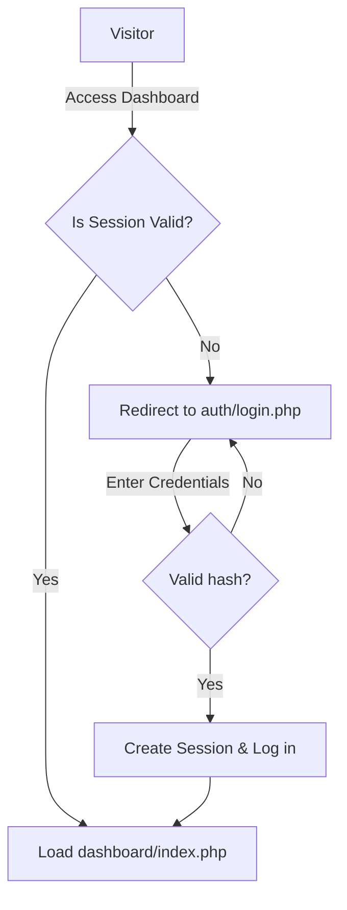
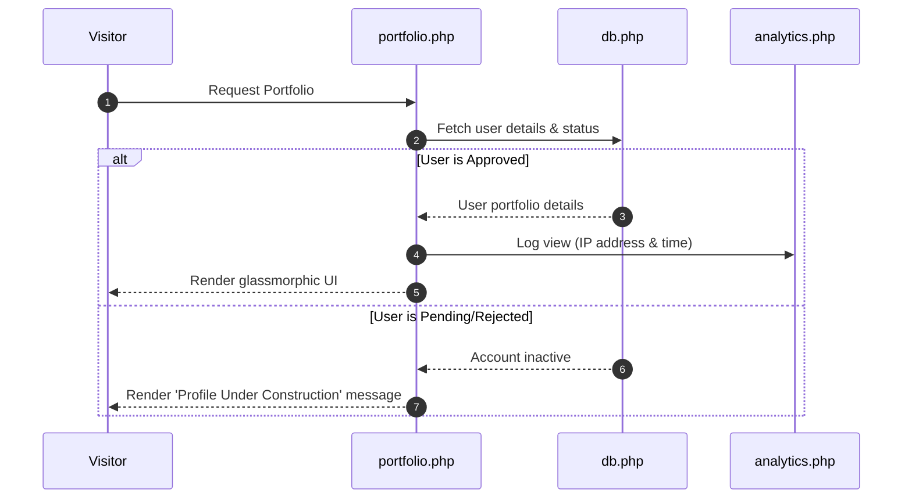
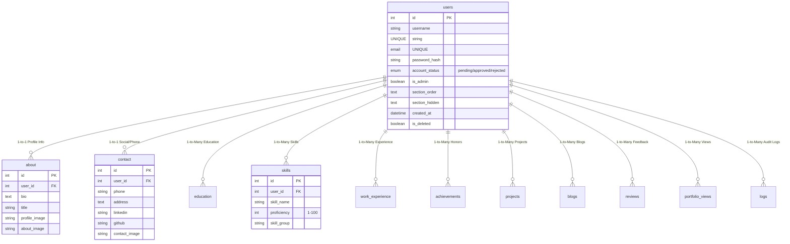

# 🎯 Portfolio Generator System - Full Project Architecture & Directory Map

Welcome to your complete interactive project reference guide! Below is a comprehensive walkthrough of the entire system architecture, directory layouts, database schemas, and data flow designs.

---

## 📂 Visual Project Directory Tree

Below is the directory map of the codebase in your workspace (`c:\Users\User\Desktop\dbms project\`). You can click on any file to view or edit it.

```text
dbms project/
├── ⚙️ config/                 # Core configurations and DB connections
│   ├── 📄 db.php              # Global PDO MySQL connection (portfolio_db)
│   ├── 📄 database.php        # Secondary PDO connection reference
│   └── 📄 imgbb.php           # Image hosting API key configurations
│
├── 🔑 auth/                   # Authentication & Session handling
│   ├── 📄 login.php           # Secure user log in with password validation
│   ├── 📄 register.php        # Secure user sign up with validation checks
│   └── 📄 logout.php          # Session termination script
│
├── 📊 dashboard/              # Dynamic User Management Panel (Logged-in pages)
│   ├── 📄 index.php           # Home dashboard with profile statistics
│   ├── 📄 about.php           # CRUD: Bio, profession title, and profile pictures
│   ├── 📄 contact.php         # CRUD: Social media links, phone, and address
│   ├── 📄 education.php       # CRUD: Degree achievements and institutions
│   ├── 📄 work.php            # CRUD: Professional job experiences
│   ├── 📄 skills.php          # CRUD: Programming languages & proficiencies
│   ├── 📄 achievements.php    # CRUD: Certificates and honors
│   ├── 📄 publications.php    # CRUD: Scientific papers or article publications
│   ├── 📄 research.php        # CRUD: Direct academic research uploads
│   ├── 📄 blogs.php           # CRUD: Personal blog posts
│   ├── 📄 order_sections.php  # Drag-and-drop / rank order toggling of portfolio sections
│   ├── 📄 qrcode.php          # QR code generation tool for sharing
│   ├── 📄 shareable_link.php  # Public profile url and sharing dashboard
│   ├── 📄 reviews.php         # View & approve ratings from visitors
│   ├── 📄 upload_image.php    # Handles file systems and cloud image updates
│   └── 📂 inc/                # Reusable UI includes for the dashboard
│       ├── 📄 head.php        # Stylesheet linkages and standard metadata
│       ├── 📄 sidebar.php     # Collapsible navigation link sidebar
│       └── 📄 foot.php        # Closing elements and core scripts
│
├── 🌍 public/                 # Public-facing portfolio generator views
│   ├── 📄 portfolio.php       # The ultimate high-fidelity responsive glassmorphic portfolio
│   └── 📄 submit_review.php   # Endpoint for visitors to leave feedback
│
├── 📄 export/
│   └── 📄 export_pdf.php      # PDF resume export tool utilising FPDF library
│
├── 👑 admin/                  # Secure Administration & Moderation Panel
│   ├── 📄 dashboard.php       # Platform statistics dashboard
│   ├── 📄 approve_users.php   # Account status management (approve/suspend/reject)
│   └── 📄 reviews.php         # Admin reviews global management and pruning
│
├── 📈 analytics/
│   └── 📄 analytics.php       # Profile visitor metrics and view tracking logs
│
├── 🗄️ sql/
│   └── 📄 full_database.sql   # The full MySQL database creation schema & triggers
│
├── 📦 vendor/                 # Third-party composer dependencies
└── 📄 composer.json           # Composer requirements (dompdf/dompdf, php-qrcode)
```

---

## 🗺️ Architectural Flows

### 1. User Access & Security Filter


### 2. Portfolio View & Tracking Sequence
When a visitor views `public/portfolio.php?user=username`:


---

## 🗄️ Relational Database Schema Design (`portfolio_db`)

The database is built on a clean relational architecture centered around the `users` table.



### Key DBMS Implementations inside `full_database.sql`:
1. **Foreign Key Integrity Rules**:
   All user-related child tables reference `users(id)` with `ON DELETE CASCADE`. If an admin deletes a user, their entire footprint (skills, logs, images, views) is cleared instantly to maintain consistency and save disk space.
2. **Audit Triggers**:
   - `after_skill_insert`: Automatically creates a log entry when a new skill is inserted.
   - `after_blog_insert`: Logs the title of any new blog published by the user.
3. **Database Performance View**:
   - `v_portfolio_summary`: Pre-aggregates user metrics (`skill_count`, `work_count`) to optimize admin dashboard render times without running nested queries repeatedly.

---

## ⚡ Technical Core Modules & Key Logic Files

### 🛡️ Authentication Module (`/auth`)
Handles password safety.
- **[register.php](/auth/register.php)**: Validates input strings (ensuring no special characters in username), checks uniqueness, hashes password using `password_hash($pass, PASSWORD_BCRYPT)`, and saves accounts in `pending` status.
- **[login.php](/auth/login.php)**: Checks credentials via `password_verify()` and sets persistent sessions (`$_SESSION['user_id']`).

### 🎛️ User Dashboard CRUD (`/dashboard`)
Fully dynamic dashboard allowing secure insertion, updating, and removal of user portfolio components.
- **[skills.php](/dashboard/skills.php)**: Validates proficiency values (1-100), handles grouped skills (Frontend, Backend, Design).
- **[order_sections.php](/dashboard/order_sections.php)**: Saves a dynamic JSON configuration (`section_order` & `section_hidden`) to define exactly which order sections appear on the live website.

### 🌐 The Glassmorphic Front-End (`/public`)
- **[portfolio.php](/public/portfolio.php)**: Combines HTML5, Vanilla CSS, and JS into a state-of-the-art premium portfolio page. Uses modern HSL styling, rich glassmorphism gradients, hover effects, CSS custom variables, and filters dynamically based on user setting configurations.

### 🖨️ PDF Generation engine (`/export`)
- **[export_pdf.php](/export/export_pdf.php)**: Uses FPDF. Fetches the user's relational tables (Education, Experience, Skills), structures the layout programmatically, and prints a professional corporate resume layout on the fly.