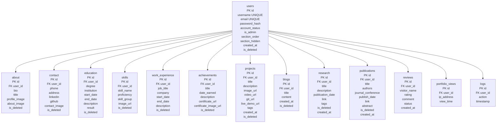

# Portfolio Generator System

## Professional Project Report

**Project Name:** Portfolio Generator System  
**Technology Stack:** PHP, MySQL, PDO, HTML, CSS, JavaScript, Dompdf, XAMPP  
**Database Name:** `portfolio_db`  
**Main Repository:** `mariaaktermukti/Portfolio_Generator`  
**Prepared For:** Academic / DBMS Project Submission  

<div style="page-break-after: always;"></div>

## Table of Contents

1. Introduction  
2. Motivation  
3. Similar Projects  
4. Benchmark Analysis  
5. Complete Features  
6. Database Design Approach  
7. Entity Relationship Diagram  
8. Schema Diagram  
9. All Queries  
10. Key User Interface  
11. Limitations  
12. Future Expansion  
13. Conclusion  

<div style="page-break-after: always;"></div>

## 1. Introduction

The Portfolio Generator System is a web-based platform that allows users to create, manage, publish, and share professional digital portfolios. A portfolio is one of the most important career documents for students, developers, researchers, designers, freelancers, and job seekers. It presents skills, education, work experience, achievements, projects, publications, research activities, blogs, contact information, and visitor reviews in a structured public profile.

This project is designed as a database-driven portfolio management system. Instead of manually coding a personal portfolio website, a user can register, wait for administrator approval, log into a dashboard, enter personal and professional information through forms, and automatically generate a public portfolio page. The public portfolio is available through a shareable URL using the username as a parameter.

The system uses PHP for server-side logic and MySQL for persistent storage. PDO is used for database communication, which improves security and maintainability compared with raw database access. The project is organized into separate modules for authentication, user dashboard management, administration, analytics, public portfolio rendering, and PDF export.

The core idea of the system is to separate content from presentation. Users provide their information through CRUD interfaces, while the application stores the data in normalized relational tables. The public portfolio page retrieves the data dynamically and presents it in a visually attractive layout. This makes the system reusable for many users rather than being limited to a single static portfolio.

The project also includes administrative control. A newly registered account is not immediately allowed to publish a portfolio. The account remains in a pending state until an admin approves it. This workflow is useful for academic environments, portfolio hosting platforms, or controlled communities where only verified users should be allowed to publish content.

From a DBMS perspective, the project demonstrates table design, primary keys, foreign keys, one-to-many relationships, soft deletion, indexing, default values, enum-based status management, aggregation queries, joins, subqueries, and view/trigger concepts. It also includes practical database usage in real application pages such as login, registration, portfolio rendering, review moderation, analytics, and PDF generation.

### 1.1 Project Scope

The system supports the following scope:

- User account registration and authentication.
- Admin approval, rejection, and pausing of users.
- User dashboard for managing portfolio data.
- Public portfolio generation from stored database records.
- Visitor review submission and moderation.
- Section ordering and visibility control.
- Analytics for platform-level insights.
- PDF export for resume-style output.
- Relational database design with foreign key integrity.

### 1.2 Target Users

The system is useful for:

- Students who need an academic or professional portfolio.
- Developers who want to present projects and skills.
- Researchers who need to list research work and publications.
- Freelancers who want a public professional profile.
- Institutions that want to manage student portfolios.
- Administrators who need to moderate users and reviews.

### 1.3 Technology Overview

| Layer | Technology | Purpose |
|---|---|---|
| Frontend | HTML, CSS, JavaScript | User interface and public portfolio presentation |
| Backend | PHP | Application logic, sessions, form processing |
| Database | MySQL | Relational data storage |
| DB Access | PDO | Secure database queries and prepared statements |
| Local Server | XAMPP | Apache and MySQL development environment |
| PDF Export | Dompdf | Portfolio/resume PDF generation |
| Version Control | Git and GitHub | Source code management |

<div style="page-break-after: always;"></div>

## 2. Motivation

The motivation for this project comes from a common problem: many people need a professional online portfolio, but not everyone has the time, design knowledge, or programming skill to build one manually. A static portfolio also becomes difficult to maintain as a person gains new skills, completes new projects, earns certificates, publishes research, or changes contact information.

Traditional portfolio creation often requires editing HTML, CSS, JavaScript, or using a third-party website builder. These methods may be time-consuming, expensive, or limited in flexibility. For students and early-career professionals, a simple system that stores data once and displays it automatically can save a significant amount of effort.

This project solves that problem by providing a structured portfolio management workflow. The user does not need to edit code. The user only interacts with forms in the dashboard. The application handles data storage, ordering, rendering, and public sharing.

### 2.1 Academic Motivation

From an academic point of view, this project is a strong DBMS project because it applies database concepts in a realistic web application. It is not only a set of isolated tables. It shows how database design affects authentication, authorization, content management, analytics, and public rendering.

Important DBMS concepts demonstrated include:

- Entity identification.
- Relationship mapping.
- Primary key and foreign key design.
- Cascading delete rules.
- Soft deletion.
- Indexing on foreign key columns.
- Prepared statements.
- Aggregation queries.
- Join queries.
- Subqueries for analytics.
- Status-based workflow using enum fields.
- Optional trigger and view design.

### 2.2 Practical Motivation

A digital portfolio has practical value in job applications, internships, scholarship applications, freelancing, and networking. A portfolio can show more than a resume because it can include visual projects, GitHub links, live demo links, certificates, reviews, blogs, publications, and contact links.

The system makes this possible by combining many career-related sections in one platform. The generated public portfolio works as a personal website. The shareable link can be placed on resumes, social media, email signatures, or QR codes.

### 2.3 Administrative Motivation

Many systems allow users to publish content instantly, but that can create quality and security problems. This project includes admin approval before a portfolio becomes visible. This makes it suitable for institutional use, such as a university department hosting student portfolios. The admin can approve legitimate users, reject unwanted accounts, pause accounts, and moderate reviews.

### 2.4 Data Management Motivation

A portfolio contains many different types of data. For example, a user can have many skills, many projects, many education records, many achievements, many reviews, and many publications. A relational database is well suited for this structure because it can represent one-to-many relationships clearly and maintain data integrity through foreign keys.

The system avoids storing all portfolio information in one large unstructured table. Instead, it uses separate tables for each logical content type. This improves maintainability, query performance, and future expansion.

<div style="page-break-after: always;"></div>

## 3. Similar Projects

Several existing systems and platforms provide portfolio creation or professional profile management. The Portfolio Generator System is inspired by these systems but is designed as a custom academic DBMS application with full control over database structure and application logic.

### 3.1 GitHub Pages Portfolio

GitHub Pages allows users to publish static websites directly from GitHub repositories. Many developers use it to host personal portfolio websites.

**Strengths:**

- Free hosting for static websites.
- Good for developers familiar with Git.
- Supports custom HTML, CSS, and JavaScript.
- Easy integration with GitHub projects.

**Weaknesses:**

- Requires technical knowledge.
- Content updates usually require code or Markdown editing.
- No built-in admin approval system.
- No database-driven dashboard.
- Not suitable for non-technical users.

**Comparison with this project:**

The Portfolio Generator System is more user-friendly for non-technical users because content is managed through forms. It also includes database storage, account approval, review moderation, and analytics.

### 3.2 LinkedIn Profile

LinkedIn is a professional networking platform where users can list education, experience, skills, certifications, posts, and contact details.

**Strengths:**

- Large professional network.
- Standardized profile sections.
- Recruiter visibility.
- Endorsements and recommendations.

**Weaknesses:**

- Limited visual customization.
- User profile is controlled by the platform.
- Not focused on portfolio-style project presentation.
- Less suitable for custom academic DBMS demonstration.

**Comparison with this project:**

The Portfolio Generator System focuses on custom portfolio presentation. It gives the developer full control over the schema, UI, workflow, and hosting environment.

### 3.3 Wix / Squarespace Portfolio Builders

Website builders such as Wix and Squarespace allow users to create professional websites using drag-and-drop tools.

**Strengths:**

- Visually polished templates.
- No coding required.
- Hosting and domain options.
- Many design components.

**Weaknesses:**

- Often paid for advanced features.
- Database logic is hidden from the developer.
- Less suitable for learning relational database design.
- Custom workflows such as admin approval may require advanced configuration.

**Comparison with this project:**

This project is smaller but more transparent. Every table, query, and workflow can be studied, modified, and improved. It is better for demonstrating DBMS concepts.

### 3.4 WordPress Portfolio Websites

WordPress can be used with portfolio themes and plugins to create personal websites.

**Strengths:**

- Mature ecosystem.
- Many themes and plugins.
- Admin dashboard included.
- Content management is powerful.

**Weaknesses:**

- Can become heavy for a simple portfolio.
- Plugin dependency can create maintenance issues.
- Database schema is generalized, not portfolio-specific.
- Custom academic reporting is harder because internals are large.

**Comparison with this project:**

The Portfolio Generator System is purpose-built. The database tables directly represent portfolio sections, making the schema easier to understand and explain.

### 3.5 Behance / Dribbble Style Portfolios

Behance and Dribbble are popular for designers and creative professionals.

**Strengths:**

- Strong visual project presentation.
- Community exposure.
- Good for creative work.

**Weaknesses:**

- Less suitable for academic records, research, publications, and structured resume data.
- Limited database and backend control for the user.
- Platform-specific presentation style.

**Comparison with this project:**

This project supports broader professional identity sections, including research, publications, education, achievements, blogs, reviews, and analytics.

<div style="page-break-after: always;"></div>

## 4. Benchmark Analysis

Benchmark analysis compares the Portfolio Generator System with similar solutions based on important criteria such as usability, customization, database control, admin workflow, analytics, cost, and academic value.

### 4.1 Benchmark Criteria

The following criteria are used for comparison:

- Ease of use.
- Database-driven content management.
- Customization capability.
- User approval workflow.
- Review moderation.
- Analytics support.
- PDF export support.
- Suitability for DBMS project.
- Cost and hosting simplicity.

### 4.2 Comparative Benchmark Table

| Criteria | Portfolio Generator | GitHub Pages | LinkedIn | Wix/Squarespace | WordPress |
|---|---:|---:|---:|---:|---:|
| No-code content update | High | Low | High | High | High |
| Database-driven design | High | Low | Hidden | Hidden/Medium | Hidden/High |
| Custom DB schema control | High | None | None | Low | Medium |
| Admin approval workflow | High | None | Platform-controlled | Low | Medium |
| Portfolio section CRUD | High | Manual | Medium | High | High |
| Public shareable profile | High | High | High | High | High |
| Visitor review moderation | High | None | Medium | Plugin-dependent | Plugin-dependent |
| Analytics | Medium | External tools | Platform analytics | Platform tools | Plugin-dependent |
| PDF export | Medium | Manual | Built-in resume options vary | Low | Plugin-dependent |
| Academic DBMS value | High | Low | Low | Low | Medium |
| Setup cost | Low | Low | Free | Medium/High | Low/Medium |

### 4.3 Functional Benchmark

| Function | This Project Implementation | Benefit |
|---|---|---|
| Registration | User creates account through registration form | Allows multi-user usage |
| Approval | Admin approves pending users | Prevents unauthorized publishing |
| Authentication | Session-based PHP login | Protects dashboard pages |
| Content CRUD | Separate pages for about, skills, projects, etc. | Organized data management |
| Public Portfolio | Generated from database using username parameter | Easy sharing |
| Reviews | Visitors submit reviews; user/admin moderates | Adds credibility and feedback |
| Analytics | Counts, popular skills, ranking score | Platform insight |
| PDF Export | Dompdf-generated resume output | Offline sharing |
| Section Ordering | User controls portfolio section order | Personalization |

### 4.4 Database Benchmark

The project uses a normalized relational structure. Compared with storing portfolio data in JSON or a single table, this approach provides:

- Better referential integrity.
- Easier querying by section.
- Clear separation of user data.
- Scalable one-to-many relationships.
- Better support for analytics and reporting.
- Easier maintenance and future module expansion.

### 4.5 Performance Considerations

The database includes indexes on `user_id` in child tables. Since most queries load data for a specific user, indexing `user_id` improves lookup performance. The application also uses `ORDER BY` clauses for chronological presentation, such as ordering work experience by `start_date`, projects by `created_at`, and publications by `publish_date`.

Potential performance bottlenecks include loading many portfolio sections in a single public page request and using multiple separate queries for each section. For the current project scale, this is acceptable and easy to understand. For a larger production system, caching or optimized combined queries could be added.

<div style="page-break-after: always;"></div>

## 5. Complete Features

The Portfolio Generator System provides features for three major user roles: visitor, registered user, and administrator.

### 5.1 Visitor Features

Visitors are people who access public portfolio pages without logging in.

#### 5.1.1 View Public Portfolio

A visitor can open a public portfolio link:

```text
public/portfolio.php?user=username
```

The system checks whether the username exists, the account is approved, and the account is not deleted. If valid, the portfolio page displays the user profile.

#### 5.1.2 View Portfolio Sections

The public portfolio can include:

- About section.
- Skills.
- Work experience.
- Projects.
- Education.
- Achievements.
- Blogs.
- Research.
- Publications.
- Contact information.
- Reviews.

#### 5.1.3 Submit Reviews

Visitors can submit a review with name, rating, and comment. The review is stored as pending until approved by the portfolio owner or admin.

#### 5.1.4 Portfolio View Tracking

When a public portfolio is viewed, the system records the visitor IP address and view time in the `portfolio_views` table. This allows the user dashboard to show view count statistics.

### 5.2 User Features

Registered users manage their own portfolio data from the dashboard.

#### 5.2.1 Registration

A new user registers with username, email, and password. The password is hashed before storage. The account is created with `account_status = 'pending'`.

#### 5.2.2 Login

Users log in using username and password. The application verifies the password hash and checks account status. Pending, rejected, or paused accounts cannot access the dashboard.

#### 5.2.3 User Dashboard

After login, a normal user is redirected to:

```text
dashboard/index.php
```

The dashboard shows important statistics such as:

- Portfolio views.
- Average rating.
- Total reviews.
- Pending reviews.

#### 5.2.4 About Management

Users can add, edit, view, and soft-delete about information:

- Biography.
- Professional title.
- Profile image.
- About image.

#### 5.2.5 Contact Management

Users can manage:

- Phone number.
- Address.
- LinkedIn URL.
- GitHub URL.
- Contact image.

#### 5.2.6 Education Management

Users can add academic records:

- Degree.
- Institution.
- Start date.
- End date.
- Description.
- Result.

#### 5.2.7 Skills Management

Users can add skill records:

- Skill name.
- Proficiency percentage.
- Skill group.
- Image URL.

This allows the public portfolio to display both technical and non-technical skills.

#### 5.2.8 Work Experience Management

Users can manage professional experience:

- Job title.
- Company.
- Start date.
- End date.
- Description.

#### 5.2.9 Achievement Management

Users can manage achievements and certificates:

- Achievement title.
- Date earned.
- Description.
- Certificate URL.
- Certificate image URL.

#### 5.2.10 Project Management

Users can manage projects:

- Project title.
- Description.
- Image URL.
- Video URL.
- GitHub URL.
- Live demo URL.
- Tags.

This section is important for developers because it connects the portfolio to real work samples.

#### 5.2.11 Blog Management

Users can add blog posts with title and content. Blogs help the portfolio show communication ability and professional thought.

#### 5.2.12 Research Management

Users can add research items:

- Research title.
- Description.
- Publication date.
- Link.
- Tags.

#### 5.2.13 Publication Management

Users can add publications:

- Title.
- Authors.
- Journal or conference.
- Publish date.
- Link.
- Abstract.

This makes the system suitable for academic users.

#### 5.2.14 Review Moderation

Users can approve, reject, or delete reviews submitted to their own portfolio. Only approved reviews appear publicly.

#### 5.2.15 Section Ordering

Users can configure the order of portfolio sections using `section_order`. They can also hide sections using `section_hidden`. This gives control over how the final portfolio appears.

#### 5.2.16 Shareable Link and QR Code

The system includes pages for shareable portfolio links and QR code generation. This helps users distribute their portfolio quickly.

#### 5.2.17 PDF Export

The PDF export module generates a resume-style PDF version of approved user data. This is useful for offline sharing and job applications.

### 5.3 Admin Features

Administrators manage the platform and moderate global activity.

#### 5.3.1 Admin Login

The SQL file inserts a default admin:

```text
Username: admin
Password: admin123
```

If `is_admin = TRUE`, the login system redirects the user to:

```text
admin/dashboard.php
```

#### 5.3.2 User Approval

Admin can approve, reject, or pause users. The `account_status` field controls user access and public visibility.

#### 5.3.3 Global Review Management

Admin can view all reviews from all portfolios and approve, reject, or delete them.

#### 5.3.4 Platform Analytics

Admin can access analytics such as:

- Most popular skill.
- Total skills.
- Total work experience records.
- Total achievements.
- Total blogs.
- Total reviews.
- User credibility ranking.
- Users grouped by location where available.

<div style="page-break-after: always;"></div>

## 6. Database Design Approach

The database is designed using a relational approach. The central entity is `users`, and most other tables reference `users(id)` through foreign keys. This creates a clean parent-child relationship between a user and their portfolio content.

### 6.1 Design Principles

The database follows these principles:

- Each major portfolio section has its own table.
- Every content table stores `user_id` as a foreign key.
- Primary keys are auto-increment integer IDs.
- User login information is stored separately from portfolio content.
- Soft deletion is used for most content tables.
- Foreign keys use `ON DELETE CASCADE` to maintain referential integrity.
- Indexes are added on `user_id` for faster section loading.
- Status fields are used for workflow control.

### 6.2 Central User Table

The `users` table stores account identity and access control. It includes:

- Unique username.
- Unique email.
- Hashed password.
- Account status.
- Admin flag.
- Section order preference.
- Hidden section preference.
- Creation time.
- Soft deletion flag.

This table is the parent table for most other tables.

### 6.3 One-to-Many Relationships

Most portfolio sections are modeled as one-to-many relationships. One user can have many education records, many skills, many projects, many achievements, many blogs, many reviews, and many view logs.

Examples:

- One user has many skills.
- One user has many projects.
- One user has many achievements.
- One user has many reviews.
- One user has many portfolio views.

### 6.4 One-to-One-Like Relationships

Some tables are conceptually one-to-one, such as `about` and `contact`, because a user usually has one active about profile and one active contact profile. However, the database still allows multiple records and uses soft deletion. This can preserve history or allow replacement records without permanently deleting old data.

### 6.5 Soft Deletion

Most content tables include `is_deleted`. Instead of physically removing records, delete actions update `is_deleted = 1`. This protects data from accidental loss and allows future restoration features.

Example:

```sql
UPDATE skills SET is_deleted = 1 WHERE id = ? AND user_id = ?;
```

### 6.6 Cascading Delete

Foreign keys use `ON DELETE CASCADE`. If a user is permanently deleted, related records are automatically removed. This prevents orphan records in child tables.

### 6.7 Indexing Strategy

Each child table includes an index on `user_id`. This improves performance because most queries filter by `user_id`.

Example:

```sql
INDEX (user_id)
```

### 6.8 Security-Oriented Design

Passwords are not stored as plain text. The registration system uses PHP password hashing. Login uses `password_verify()` to compare the submitted password with the stored hash.

Prepared statements are used in most user-input queries to reduce SQL injection risk.

### 6.9 Status-Oriented Workflow

The `account_status` field controls account access:

- `pending`: User registered but not approved.
- `approved`: User can log in and publish portfolio.
- `rejected`: User cannot access the system.
- `paused`: Used in admin logic to temporarily disable an account.

The SQL schema currently defines `pending`, `approved`, and `rejected`, while the admin page extends the enum to include `paused`.

<div style="page-break-after: always;"></div>

## 7. Entity Relationship Diagram

The following Mermaid ER diagram represents the major entities and relationships in the system.

```mermaid
erDiagram
    users ||--o{ about : owns
    users ||--o{ contact : owns
    users ||--o{ education : owns
    users ||--o{ skills : owns
    users ||--o{ work_experience : owns
    users ||--o{ achievements : owns
    users ||--o{ projects : owns
    users ||--o{ blogs : owns
    users ||--o{ research : owns
    users ||--o{ publications : owns
    users ||--o{ reviews : receives
    users ||--o{ portfolio_views : receives
    users ||--o{ logs : generates

    users {
        INT id PK
        VARCHAR username UK
        VARCHAR email UK
        VARCHAR password_hash
        ENUM account_status
        BOOLEAN is_admin
        TEXT section_order
        TEXT section_hidden
        DATETIME created_at
        BOOLEAN is_deleted
    }

    about {
        INT id PK
        INT user_id FK
        TEXT bio
        VARCHAR title
        VARCHAR profile_image
        VARCHAR about_image
        BOOLEAN is_deleted
    }

    contact {
        INT id PK
        INT user_id FK
        VARCHAR phone
        TEXT address
        VARCHAR linkedin
        VARCHAR github
        VARCHAR contact_image
        BOOLEAN is_deleted
    }

    education {
        INT id PK
        INT user_id FK
        VARCHAR degree
        VARCHAR institution
        DATE start_date
        DATE end_date
        TEXT description
        VARCHAR result
        BOOLEAN is_deleted
    }

    skills {
        INT id PK
        INT user_id FK
        VARCHAR skill_name
        INT proficiency
        VARCHAR skill_group
        VARCHAR image_url
        BOOLEAN is_deleted
    }

    work_experience {
        INT id PK
        INT user_id FK
        VARCHAR job_title
        VARCHAR company
        DATE start_date
        DATE end_date
        TEXT description
        BOOLEAN is_deleted
    }

    achievements {
        INT id PK
        INT user_id FK
        VARCHAR title
        DATE date_earned
        TEXT description
        VARCHAR certificate_url
        VARCHAR certificate_image_url
        BOOLEAN is_deleted
    }

    projects {
        INT id PK
        INT user_id FK
        VARCHAR title
        TEXT description
        VARCHAR image_url
        VARCHAR video_url
        VARCHAR git_url
        VARCHAR live_demo_url
        VARCHAR tags
        DATETIME created_at
        BOOLEAN is_deleted
    }

    blogs {
        INT id PK
        INT user_id FK
        VARCHAR title
        TEXT content
        DATETIME created_at
        BOOLEAN is_deleted
    }

    research {
        INT id PK
        INT user_id FK
        VARCHAR title
        TEXT description
        DATE publication_date
        VARCHAR link
        VARCHAR tags
        TINYINT is_deleted
        TIMESTAMP created_at
    }

    publications {
        INT id PK
        INT user_id FK
        VARCHAR title
        VARCHAR authors
        VARCHAR journal_conference
        DATE publish_date
        VARCHAR link
        TEXT abstract
        TINYINT is_deleted
        TIMESTAMP created_at
    }

    reviews {
        INT id PK
        INT user_id FK
        VARCHAR visitor_name
        INT rating
        TEXT comment
        ENUM status
        DATETIME created_at
    }

    portfolio_views {
        INT id PK
        INT user_id FK
        VARCHAR ip_address
        DATETIME view_time
    }

    logs {
        INT id PK
        INT user_id FK
        VARCHAR action
        DATETIME timestamp
    }
```



### 7.1 Relationship Explanation

The `users` table is the parent of almost every data table. Every user-specific table includes `user_id`, which references `users(id)`. This allows the system to retrieve all portfolio data for a particular user.

For example, when the public portfolio page loads, it first finds the user by username. Then it uses the returned user ID to load education, skills, work experience, achievements, projects, blogs, research, publications, and reviews.

### 7.2 Cardinality

| Relationship | Cardinality | Explanation |
|---|---|---|
| users to skills | One-to-many | A user can have many skills |
| users to projects | One-to-many | A user can have many projects |
| users to reviews | One-to-many | A user can receive many reviews |
| users to portfolio_views | One-to-many | A user can have many view records |
| users to about | One-to-many in schema, one active expected | Allows profile replacement/history |
| users to contact | One-to-many in schema, one active expected | Allows contact replacement/history |

<div style="page-break-after: always;"></div>

## 8. Schema Diagram

The schema diagram below presents the database structure from a table and foreign-key perspective.



### 8.1 Table Summary

| Table | Purpose |
|---|---|
| `users` | Stores user accounts, admin flag, account status, and section preferences |
| `about` | Stores biography and profile images |
| `contact` | Stores phone, address, LinkedIn, GitHub, and contact image |
| `education` | Stores academic background |
| `skills` | Stores skills, proficiency, groups, and icons/images |
| `work_experience` | Stores professional experience |
| `achievements` | Stores awards, certificates, and achievement images |
| `projects` | Stores portfolio projects and related links |
| `blogs` | Stores user blog entries |
| `research` | Stores research work |
| `publications` | Stores publication details |
| `reviews` | Stores visitor reviews and moderation status |
| `portfolio_views` | Stores portfolio visit tracking records |
| `logs` | Stores audit log actions |

<div style="page-break-after: always;"></div>

## 9. All Queries

This section lists the major SQL queries used by the project. Queries are grouped by module for readability.

### 9.1 Database Creation

```sql
CREATE DATABASE IF NOT EXISTS portfolio_db;
USE portfolio_db;
```

### 9.2 Users Table

```sql
CREATE TABLE IF NOT EXISTS users (
    id INT AUTO_INCREMENT PRIMARY KEY,
    username VARCHAR(50) NOT NULL UNIQUE,
    email VARCHAR(100) NOT NULL UNIQUE,
    password_hash VARCHAR(255) NOT NULL,
    account_status ENUM('pending', 'approved', 'rejected') DEFAULT 'pending',
    is_admin BOOLEAN DEFAULT FALSE,
    section_order TEXT,
    section_hidden TEXT,
    created_at DATETIME DEFAULT CURRENT_TIMESTAMP,
    is_deleted BOOLEAN DEFAULT FALSE
);
```

```sql
INSERT IGNORE INTO users (username, email, password_hash, account_status, is_admin)
VALUES ('admin', 'admin@example.com',
'$2y$10$9stKS6TZqMD/ezDuklvvTuO9/rq9MvOgb9ZUMvtquXStCpGTBm3hW',
'approved', TRUE);
```

### 9.3 About Table

```sql
CREATE TABLE IF NOT EXISTS about (
    id INT AUTO_INCREMENT PRIMARY KEY,
    user_id INT NOT NULL,
    bio TEXT,
    title VARCHAR(100),
    profile_image VARCHAR(255),
    about_image VARCHAR(255),
    is_deleted BOOLEAN DEFAULT FALSE,
    FOREIGN KEY (user_id) REFERENCES users(id) ON DELETE CASCADE,
    INDEX (user_id)
);
```

```sql
ALTER TABLE about ADD COLUMN about_image VARCHAR(255) DEFAULT '';
```

```sql
INSERT INTO about (user_id, bio, title, profile_image, about_image)
VALUES (?, ?, ?, ?, ?);
```

```sql
UPDATE about
SET bio = ?, title = ?, profile_image = ?, about_image = ?
WHERE id = ? AND user_id = ?;
```

```sql
UPDATE about SET is_deleted = 1 WHERE id = ? AND user_id = ?;
```

```sql
SELECT * FROM about
WHERE user_id = ? AND is_deleted = 0
ORDER BY id DESC;
```

### 9.4 Contact Table

```sql
CREATE TABLE IF NOT EXISTS contact (
    id INT AUTO_INCREMENT PRIMARY KEY,
    user_id INT NOT NULL,
    phone VARCHAR(20),
    address TEXT,
    linkedin VARCHAR(255),
    github VARCHAR(255),
    contact_image VARCHAR(255),
    is_deleted BOOLEAN DEFAULT FALSE,
    FOREIGN KEY (user_id) REFERENCES users(id) ON DELETE CASCADE,
    INDEX (user_id)
);
```

```sql
ALTER TABLE contact ADD COLUMN contact_image VARCHAR(255) DEFAULT '';
```

```sql
INSERT INTO contact (user_id, phone, address, linkedin, github, contact_image)
VALUES (?, ?, ?, ?, ?, ?);
```

```sql
UPDATE contact
SET phone = ?, address = ?, linkedin = ?, github = ?, contact_image = ?
WHERE id = ? AND user_id = ?;
```

```sql
UPDATE contact SET is_deleted = 1 WHERE id = ? AND user_id = ?;
```

```sql
SELECT * FROM contact
WHERE user_id = ? AND is_deleted = 0
ORDER BY id DESC;
```

### 9.5 Education Table

```sql
CREATE TABLE IF NOT EXISTS education (
    id INT AUTO_INCREMENT PRIMARY KEY,
    user_id INT NOT NULL,
    degree VARCHAR(150),
    institution VARCHAR(150),
    start_date DATE,
    end_date DATE,
    description TEXT,
    result VARCHAR(100),
    is_deleted BOOLEAN DEFAULT FALSE,
    FOREIGN KEY (user_id) REFERENCES users(id) ON DELETE CASCADE,
    INDEX (user_id)
);
```

```sql
ALTER TABLE education ADD COLUMN result VARCHAR(50) DEFAULT '';
```

```sql
INSERT INTO education
(user_id, degree, institution, start_date, end_date, description, result)
VALUES (?, ?, ?, ?, ?, ?, ?);
```

```sql
UPDATE education
SET degree = ?, institution = ?, start_date = ?, end_date = ?, description = ?, result = ?
WHERE id = ? AND user_id = ?;
```

```sql
UPDATE education SET is_deleted = 1 WHERE id = ? AND user_id = ?;
```

```sql
SELECT * FROM education
WHERE user_id = ? AND is_deleted = 0
ORDER BY start_date DESC;
```

### 9.6 Skills Table

```sql
CREATE TABLE IF NOT EXISTS skills (
    id INT AUTO_INCREMENT PRIMARY KEY,
    user_id INT NOT NULL,
    skill_name VARCHAR(100),
    proficiency INT,
    skill_group VARCHAR(100),
    image_url VARCHAR(255),
    is_deleted BOOLEAN DEFAULT FALSE,
    FOREIGN KEY (user_id) REFERENCES users(id) ON DELETE CASCADE,
    INDEX (user_id)
);
```

```sql
ALTER TABLE skills ADD COLUMN skill_group VARCHAR(100) DEFAULT 'Other';
```

```sql
ALTER TABLE skills ADD COLUMN image_url VARCHAR(500) DEFAULT '';
```

```sql
INSERT INTO skills (user_id, skill_name, proficiency, skill_group, image_url)
VALUES (?, ?, ?, ?, ?);
```

```sql
UPDATE skills
SET skill_name = ?, proficiency = ?, skill_group = ?, image_url = ?
WHERE id = ? AND user_id = ?;
```

```sql
UPDATE skills SET is_deleted = 1 WHERE id = ? AND user_id = ?;
```

```sql
SELECT * FROM skills
WHERE user_id = ? AND is_deleted = 0
ORDER BY skill_group, proficiency DESC;
```

### 9.7 Work Experience Table

```sql
CREATE TABLE IF NOT EXISTS work_experience (
    id INT AUTO_INCREMENT PRIMARY KEY,
    user_id INT NOT NULL,
    job_title VARCHAR(150),
    company VARCHAR(150),
    start_date DATE,
    end_date DATE,
    description TEXT,
    is_deleted BOOLEAN DEFAULT FALSE,
    FOREIGN KEY (user_id) REFERENCES users(id) ON DELETE CASCADE,
    INDEX (user_id)
);
```

```sql
INSERT INTO work_experience
(user_id, job_title, company, start_date, end_date, description)
VALUES (?, ?, ?, ?, ?, ?);
```

```sql
UPDATE work_experience
SET job_title = ?, company = ?, start_date = ?, end_date = ?, description = ?
WHERE id = ? AND user_id = ?;
```

```sql
UPDATE work_experience SET is_deleted = 1 WHERE id = ? AND user_id = ?;
```

```sql
SELECT * FROM work_experience
WHERE user_id = ? AND is_deleted = 0
ORDER BY start_date DESC;
```

### 9.8 Achievements Table

```sql
CREATE TABLE IF NOT EXISTS achievements (
    id INT AUTO_INCREMENT PRIMARY KEY,
    user_id INT NOT NULL,
    title VARCHAR(150),
    date_earned DATE,
    description TEXT,
    certificate_url VARCHAR(255),
    certificate_image_url VARCHAR(255),
    is_deleted BOOLEAN DEFAULT FALSE,
    FOREIGN KEY (user_id) REFERENCES users(id) ON DELETE CASCADE,
    INDEX (user_id)
);
```

```sql
ALTER TABLE achievements ADD COLUMN certificate_url VARCHAR(500) DEFAULT '';
```

```sql
ALTER TABLE achievements ADD COLUMN certificate_image_url VARCHAR(500) DEFAULT '';
```

```sql
INSERT INTO achievements
(user_id, title, date_earned, description, certificate_url, certificate_image_url)
VALUES (?, ?, ?, ?, ?, ?);
```

```sql
UPDATE achievements
SET title = ?, date_earned = ?, description = ?, certificate_url = ?, certificate_image_url = ?
WHERE id = ? AND user_id = ?;
```

```sql
UPDATE achievements SET is_deleted = 1 WHERE id = ? AND user_id = ?;
```

```sql
SELECT * FROM achievements
WHERE user_id = ? AND is_deleted = 0
ORDER BY date_earned DESC;
```

### 9.9 Projects Table

```sql
CREATE TABLE IF NOT EXISTS projects (
    id INT AUTO_INCREMENT PRIMARY KEY,
    user_id INT NOT NULL,
    title VARCHAR(200),
    description TEXT,
    image_url VARCHAR(500),
    video_url VARCHAR(500),
    git_url VARCHAR(500),
    live_demo_url VARCHAR(500),
    tags VARCHAR(255),
    created_at DATETIME DEFAULT CURRENT_TIMESTAMP,
    is_deleted BOOLEAN DEFAULT FALSE,
    FOREIGN KEY (user_id) REFERENCES users(id) ON DELETE CASCADE,
    INDEX (user_id)
);
```

```sql
INSERT INTO projects
(user_id, title, description, image_url, video_url, git_url, live_demo_url, tags)
VALUES (?, ?, ?, ?, ?, ?, ?, ?);
```

```sql
UPDATE projects
SET title = ?, description = ?, image_url = ?, video_url = ?, git_url = ?, live_demo_url = ?, tags = ?
WHERE id = ? AND user_id = ?;
```

```sql
UPDATE projects SET is_deleted = 1 WHERE id = ? AND user_id = ?;
```

```sql
SELECT * FROM projects
WHERE user_id = ? AND is_deleted = 0
ORDER BY created_at DESC;
```

### 9.10 Blogs Table

```sql
CREATE TABLE IF NOT EXISTS blogs (
    id INT AUTO_INCREMENT PRIMARY KEY,
    user_id INT NOT NULL,
    title VARCHAR(200),
    content TEXT,
    created_at DATETIME DEFAULT CURRENT_TIMESTAMP,
    is_deleted BOOLEAN DEFAULT FALSE,
    FOREIGN KEY (user_id) REFERENCES users(id) ON DELETE CASCADE,
    INDEX (user_id)
);
```

```sql
INSERT INTO blogs (user_id, title, content) VALUES (?, ?, ?);
```

```sql
UPDATE blogs SET title = ?, content = ? WHERE id = ? AND user_id = ?;
```

```sql
UPDATE blogs SET is_deleted = 1 WHERE id = ? AND user_id = ?;
```

```sql
SELECT * FROM blogs
WHERE user_id = ? AND is_deleted = 0
ORDER BY created_at DESC;
```

### 9.11 Research Table

```sql
CREATE TABLE IF NOT EXISTS research (
    id INT AUTO_INCREMENT PRIMARY KEY,
    user_id INT NOT NULL,
    title VARCHAR(255) NOT NULL,
    description TEXT,
    publication_date DATE,
    link VARCHAR(255),
    tags VARCHAR(255),
    is_deleted TINYINT DEFAULT 0,
    created_at TIMESTAMP DEFAULT CURRENT_TIMESTAMP,
    FOREIGN KEY (user_id) REFERENCES users(id) ON DELETE CASCADE,
    INDEX (user_id)
);
```

```sql
INSERT INTO research
(user_id, title, description, publication_date, link, tags)
VALUES (?, ?, ?, ?, ?, ?);
```

```sql
UPDATE research
SET title = ?, description = ?, publication_date = ?, link = ?, tags = ?
WHERE id = ? AND user_id = ?;
```

```sql
UPDATE research SET is_deleted = 1 WHERE id = ? AND user_id = ?;
```

```sql
SELECT * FROM research
WHERE user_id = ? AND is_deleted = 0
ORDER BY publication_date DESC, created_at DESC;
```

### 9.12 Publications Table

```sql
CREATE TABLE IF NOT EXISTS publications (
    id INT AUTO_INCREMENT PRIMARY KEY,
    user_id INT NOT NULL,
    title VARCHAR(255) NOT NULL,
    authors VARCHAR(255),
    journal_conference VARCHAR(255),
    publish_date DATE,
    link VARCHAR(255),
    abstract TEXT,
    is_deleted TINYINT DEFAULT 0,
    created_at TIMESTAMP DEFAULT CURRENT_TIMESTAMP,
    FOREIGN KEY (user_id) REFERENCES users(id) ON DELETE CASCADE,
    INDEX (user_id)
);
```

```sql
INSERT INTO publications
(user_id, title, authors, journal_conference, publish_date, link, abstract)
VALUES (?, ?, ?, ?, ?, ?, ?);
```

```sql
UPDATE publications
SET title = ?, authors = ?, journal_conference = ?, publish_date = ?, link = ?, abstract = ?
WHERE id = ? AND user_id = ?;
```

```sql
UPDATE publications SET is_deleted = 1 WHERE id = ? AND user_id = ?;
```

```sql
SELECT * FROM publications
WHERE user_id = ? AND is_deleted = 0
ORDER BY publish_date DESC, created_at DESC;
```

### 9.13 Reviews Table

```sql
CREATE TABLE IF NOT EXISTS reviews (
    id INT AUTO_INCREMENT PRIMARY KEY,
    user_id INT NOT NULL,
    visitor_name VARCHAR(100),
    rating INT CHECK (rating >= 1 AND rating <= 5),
    comment TEXT,
    status ENUM('pending', 'approved', 'rejected') DEFAULT 'pending',
    created_at DATETIME DEFAULT CURRENT_TIMESTAMP,
    FOREIGN KEY (user_id) REFERENCES users(id) ON DELETE CASCADE,
    INDEX (user_id)
);
```

```sql
ALTER TABLE reviews ADD COLUMN status VARCHAR(20) DEFAULT 'pending';
```

```sql
INSERT INTO reviews (user_id, visitor_name, rating, comment, status)
VALUES (?, ?, ?, ?, 'pending');
```

```sql
SELECT * FROM reviews
WHERE user_id = ?
ORDER BY created_at DESC;
```

```sql
SELECT * FROM reviews
WHERE user_id = ? AND status = 'approved'
ORDER BY created_at DESC;
```

```sql
SELECT AVG(rating) AS avg_rating
FROM reviews
WHERE user_id = ?;
```

```sql
UPDATE reviews SET status = 'approved' WHERE id = ?;
```

```sql
UPDATE reviews SET status = 'rejected' WHERE id = ?;
```

```sql
DELETE FROM reviews WHERE id = ?;
```

### 9.14 Portfolio Views Table

```sql
CREATE TABLE IF NOT EXISTS portfolio_views (
    id INT AUTO_INCREMENT PRIMARY KEY,
    user_id INT NOT NULL,
    ip_address VARCHAR(45),
    view_time DATETIME DEFAULT CURRENT_TIMESTAMP,
    FOREIGN KEY (user_id) REFERENCES users(id) ON DELETE CASCADE,
    INDEX (user_id)
);
```

```sql
INSERT INTO portfolio_views (user_id, ip_address) VALUES (?, ?);
```

```sql
SELECT COUNT(*) FROM portfolio_views WHERE user_id = ?;
```

### 9.15 Logs Table

```sql
CREATE TABLE IF NOT EXISTS logs (
    id INT AUTO_INCREMENT PRIMARY KEY,
    user_id INT NOT NULL,
    action VARCHAR(255),
    timestamp DATETIME DEFAULT CURRENT_TIMESTAMP,
    FOREIGN KEY (user_id) REFERENCES users(id) ON DELETE CASCADE,
    INDEX (user_id)
);
```

### 9.16 Authentication Queries

```sql
SELECT id FROM users WHERE username = ? OR email = ?;
```

```sql
INSERT INTO users (username, email, password_hash, account_status)
VALUES (?, ?, ?, 'pending');
```

```sql
SELECT * FROM users
WHERE username = ? AND is_deleted = 0;
```

### 9.17 Admin User Management Queries

```sql
ALTER TABLE users
MODIFY COLUMN account_status
ENUM('pending', 'approved', 'rejected', 'paused') DEFAULT 'pending';
```

```sql
UPDATE users
SET account_status = 'approved', is_deleted = 0
WHERE id = ?;
```

```sql
UPDATE users
SET account_status = 'rejected', is_deleted = 1
WHERE id = ?;
```

```sql
UPDATE users
SET account_status = 'paused'
WHERE id = ?;
```

```sql
SELECT id, username, email, account_status, created_at
FROM users
WHERE is_admin = 0
ORDER BY created_at DESC;
```

### 9.18 Public Portfolio Queries

```sql
SELECT u.id as user_id, u.username, u.email,
       a.bio, a.title, a.profile_image, a.about_image,
       c.phone, c.address, c.linkedin, c.github, c.contact_image
FROM users u
LEFT JOIN about a ON u.id = a.user_id AND a.is_deleted = 0
LEFT JOIN contact c ON u.id = c.user_id AND c.is_deleted = 0
WHERE u.username = ? AND u.account_status = 'approved' AND u.is_deleted = 0;
```

```sql
SELECT e.* FROM education e
JOIN users u ON e.user_id = u.id
WHERE u.id = ? AND e.is_deleted = 0
ORDER BY e.start_date DESC;
```

```sql
SELECT s.* FROM skills s
JOIN users u ON s.user_id = u.id
WHERE u.id = ? AND s.is_deleted = 0
ORDER BY s.proficiency DESC;
```

```sql
SELECT w.* FROM work_experience w
JOIN users u ON w.user_id = u.id
WHERE u.id = ? AND w.is_deleted = 0
ORDER BY w.start_date DESC;
```

```sql
SELECT p.* FROM projects p
JOIN users u ON p.user_id = u.id
WHERE u.id = ? AND p.is_deleted = 0
ORDER BY p.created_at DESC;
```

```sql
SELECT section_order FROM users WHERE id = ?;
```

```sql
SELECT section_order, section_hidden FROM users WHERE id = ?;
```

```sql
UPDATE users
SET section_order = ?, section_hidden = ?
WHERE id = ?;
```

### 9.19 Dashboard Statistics Queries

```sql
SELECT COUNT(*) FROM portfolio_views WHERE user_id = ?;
```

```sql
SELECT AVG(rating) FROM reviews WHERE user_id = ?;
```

```sql
SELECT COUNT(*) FROM reviews WHERE user_id = ?;
```

```sql
SELECT COUNT(*) FROM reviews
WHERE user_id = ? AND status = 'pending';
```

### 9.20 Admin Review Query

```sql
SELECT r.*, u.username
FROM reviews r
JOIN users u ON r.user_id = u.id
ORDER BY r.created_at DESC;
```

### 9.21 Analytics Queries

```sql
SELECT skill_name, COUNT(*) as cnt
FROM skills
WHERE is_deleted = 0
GROUP BY skill_name
ORDER BY cnt DESC
LIMIT 1;
```

```sql
SELECT
    (SELECT COUNT(*) FROM skills WHERE is_deleted = 0) as total_skills,
    (SELECT COUNT(*) FROM work_experience WHERE is_deleted = 0) as total_work,
    (SELECT COUNT(*) FROM achievements WHERE is_deleted = 0) as total_achievements,
    (SELECT COUNT(*) FROM blogs WHERE is_deleted = 0) as total_blogs,
    (SELECT COUNT(*) FROM reviews) as total_reviews;
```

```sql
SELECT u.username,
       (
         (SELECT IFNULL(AVG(rating),0) FROM reviews WHERE user_id = u.id) * 0.4 +
         (SELECT COUNT(*) FROM skills WHERE user_id = u.id AND is_deleted=0) * 0.2 +
         (SELECT COUNT(*) FROM work_experience WHERE user_id = u.id AND is_deleted=0) * 0.2 +
         (SELECT COUNT(*) FROM achievements WHERE user_id = u.id AND is_deleted=0) * 0.1 +
         (SELECT COUNT(*) FROM blogs WHERE user_id = u.id AND is_deleted=0) * 0.1
       ) AS credibility_score
FROM users u
WHERE u.account_status = 'approved' AND u.is_deleted = 0
ORDER BY credibility_score DESC;
```

```sql
ALTER TABLE users ADD COLUMN location VARCHAR(100) DEFAULT NULL;
```

```sql
SELECT id, username, location, profile_image, email
FROM users
WHERE account_status = 'approved'
  AND is_deleted = 0
  AND location IS NOT NULL
  AND location != ''
ORDER BY location, username;
```

### 9.22 Optional Trigger Queries

The SQL file contains commented trigger examples for audit logs.

```sql
CREATE TRIGGER after_skill_insert
AFTER INSERT ON skills
FOR EACH ROW
BEGIN
    INSERT INTO logs (user_id, action)
    VALUES (NEW.user_id, CONCAT('Added new skill: ', NEW.skill_name));
END;
```

```sql
CREATE TRIGGER after_blog_insert
AFTER INSERT ON blogs
FOR EACH ROW
BEGIN
    INSERT INTO logs (user_id, action)
    VALUES (NEW.user_id, CONCAT('Added new blog: ', NEW.title));
END;
```

### 9.23 Optional View Query

The SQL file also contains a commented database view for portfolio summaries.

```sql
CREATE OR REPLACE VIEW v_portfolio_summary AS
SELECT
    u.id AS user_id,
    u.username,
    u.email,
    a.title AS professional_title,
    a.profile_image,
    c.phone,
    (SELECT COUNT(*) FROM skills WHERE user_id = u.id AND is_deleted = 0) AS skill_count,
    (SELECT COUNT(*) FROM work_experience WHERE user_id = u.id AND is_deleted = 0) AS work_count
FROM users u
LEFT JOIN about a ON u.id = a.user_id AND a.is_deleted = 0
LEFT JOIN contact c ON u.id = c.user_id AND c.is_deleted = 0
WHERE u.is_deleted = 0 AND u.account_status = 'approved';
```

<div style="page-break-after: always;"></div>

## 10. Key User Interface

The system contains several key interfaces. Each interface is connected to a specific role and workflow.

### 10.1 Login Interface

The login interface allows users and admins to authenticate using username and password. The backend verifies:

- Username exists.
- Account is not deleted.
- Password hash matches.
- Account is not pending, rejected, or paused.

After successful login:

- Admin is redirected to `admin/dashboard.php`.
- Normal user is redirected to `dashboard/index.php`.

### 10.2 Registration Interface

The registration interface collects:

- Username.
- Email.
- Password.

The system checks whether username or email already exists. If not, it hashes the password and inserts the new user as pending. This ensures every user must be reviewed by the administrator.

### 10.3 User Dashboard

The user dashboard is the central control panel for portfolio owners. It displays statistics and provides navigation to CRUD pages. Important dashboard metrics include portfolio view count, average rating, total reviews, and pending reviews.

### 10.4 About UI

The About UI allows the user to enter a biography, professional title, profile image, and about image. This section builds the identity area of the public portfolio.

### 10.5 Skills UI

The Skills UI allows the user to add skill name, proficiency, group, and image. Skill grouping improves organization for technical portfolios where skills may belong to categories such as frontend, backend, database, design, or tools.

### 10.6 Projects UI

The Projects UI is one of the most important screens. It allows users to document practical work with description, image, video, GitHub link, live demo link, and tags. For a developer portfolio, this section directly demonstrates ability.

### 10.7 Education and Work UI

Education and work pages allow users to maintain chronological records. The public portfolio orders records by date, making the profile easy to read.

### 10.8 Research and Publications UI

These interfaces make the system suitable for academic users. A researcher can list research work, publication metadata, authors, journal/conference name, links, abstracts, and publication dates.

### 10.9 Review Management UI

There are two review management levels:

- User-level review moderation for reviews on the user's own portfolio.
- Admin-level review moderation for all reviews across the platform.

This layered approach improves content quality and protects users from unwanted public comments.

### 10.10 Section Ordering UI

The section ordering interface lets users control how the public portfolio is arranged. This is important because different users may want different priorities. For example:

- A student may place education first.
- A developer may place projects first.
- A researcher may place publications first.
- A freelancer may place reviews and projects first.

### 10.11 Public Portfolio UI

The public portfolio page is the main output of the system. It dynamically loads approved user data and renders it in a polished format. It supports many sections and uses the user's saved section order.

The public URL format is:

```text
public/portfolio.php?user=username
```

### 10.12 Admin Dashboard UI

The admin dashboard provides platform-level control. Admin users can access account approval, global review moderation, and analytics.

### 10.13 Analytics UI

The analytics interface provides insight into the system. It includes popular skill, global counts, credibility score ranking, and users by location where available.

### 10.14 PDF Export UI

The PDF export feature uses stored data to generate a resume-like document. This helps users reuse portfolio content for job applications.

<div style="page-break-after: always;"></div>

## 11. Limitations

Although the Portfolio Generator System is functional and suitable for an academic DBMS project, it has several limitations.

### 11.1 Limited Role System

The system currently has two main roles: admin and normal user. It does not include advanced roles such as editor, moderator, institution manager, or viewer.

### 11.2 Mixed Schema Migration Approach

Some PHP files run `ALTER TABLE` statements to add columns if they do not exist. This is convenient during development but not ideal for production. A professional system should use versioned migration files.

### 11.3 Limited Validation

The system includes basic validation, but more advanced validation could be added for:

- URL format.
- Image URL format.
- Date consistency.
- Skill proficiency range.
- Email format.
- Maximum text length.

### 11.4 Public Portfolio Query Load

The public portfolio page runs multiple queries to load different sections. This is simple and readable, but a high-traffic production system may need caching or query optimization.

### 11.5 No Advanced Image Management

The project stores image URLs. A full production system could include image resizing, local file storage rules, cloud storage, file validation, and automatic cleanup of unused images.

### 11.6 Limited Search and Discovery

The public portfolio is accessed by username. The system does not yet include a public search page for discovering users by skill, location, research area, or project tag.

### 11.7 Basic Analytics

Analytics are useful but limited. The system records IP address and view time, but it does not include advanced metrics such as unique visitors, device type, referrer source, geographic tracking, or section engagement.

### 11.8 No Email Verification

Registration does not include email verification. This means users can register with invalid or unverified emails.

### 11.9 No Password Reset

The system does not currently include forgot-password or reset-password functionality.

### 11.10 Security Hardening Needed for Production

For production deployment, the system should add:

- CSRF protection.
- Rate limiting.
- Stronger session security.
- Secure cookies.
- Error logging instead of displaying database errors.
- Content Security Policy.
- Sanitized rich text handling.

### 11.11 Default Admin Credential Risk

The SQL file creates a default admin account with a known password. This is useful for setup but should be changed immediately in a real deployment.

### 11.12 Incomplete Audit Logging

The SQL file includes optional triggers for logging skill and blog inserts, but they are commented out. A complete audit system would log create, update, delete, approve, reject, and login events.

<div style="page-break-after: always;"></div>

## 12. Future Expansion

The project has many opportunities for future improvement.

### 12.1 Versioned Database Migrations

Instead of running schema changes inside PHP pages, future versions should include migration files such as:

- `001_create_users.sql`
- `002_create_portfolio_tables.sql`
- `003_add_reviews_status.sql`
- `004_add_location_to_users.sql`

This would make database updates more controlled and professional.

### 12.2 Email Verification

New users could receive an email verification link. The account would remain inactive until the email is verified.

### 12.3 Password Reset

A forgot-password feature could allow users to reset passwords securely through email tokens.

### 12.4 Advanced Role-Based Access Control

The system could support more roles:

- Super admin.
- Institution admin.
- Moderator.
- User.
- Guest.

This would make the platform suitable for larger organizations.

### 12.5 Portfolio Templates

Users could choose different portfolio templates:

- Developer template.
- Academic template.
- Designer template.
- Freelancer template.
- Minimal resume template.

The same database could support multiple frontend designs.

### 12.6 Public Directory and Search

A public directory could allow visitors to search approved portfolios by:

- Skill.
- Location.
- Project tag.
- Education.
- Research area.
- Rating.

### 12.7 Advanced Analytics

Analytics could be improved with:

- Unique visitor tracking.
- Daily/weekly/monthly views.
- Referrer tracking.
- Device and browser information.
- Most viewed portfolio sections.
- Conversion tracking for contact clicks.

### 12.8 API Development

The project could expose REST API endpoints for mobile apps or external integrations.

Example endpoints:

- `GET /api/portfolio/{username}`
- `POST /api/reviews`
- `GET /api/users/{id}/projects`
- `GET /api/analytics`

### 12.9 Better Image Upload and Storage

The system could support:

- Local image upload.
- Cloud storage.
- Image compression.
- Image cropping.
- File type validation.
- Automatic thumbnail generation.

### 12.10 Notification System

Users could receive notifications when:

- Admin approves account.
- Visitor submits review.
- Review is approved or rejected.
- Portfolio reaches a view milestone.

### 12.11 Resume Builder Enhancements

PDF export could be expanded with:

- Multiple resume templates.
- Custom section selection.
- Font and color selection.
- Page size options.
- Download history.

### 12.12 Improved Review System

Future review improvements could include:

- Verified reviewer badges.
- Review reply feature.
- Spam detection.
- Review reporting.
- Rating breakdown charts.

### 12.13 Complete Audit Trail

The `logs` table could be expanded into a full audit system. Every important action could be logged:

- Login.
- Logout.
- Profile update.
- Project creation.
- Account approval.
- Review moderation.
- PDF export.

### 12.14 Deployment Improvements

Future deployment could include:

- Environment-based configuration.
- Production error handling.
- HTTPS setup.
- Database backup scripts.
- CI/CD pipeline.
- Docker setup.

<div style="page-break-after: always;"></div>

## 13. Conclusion

The Portfolio Generator System is a complete database-driven web application for creating and managing professional portfolios. It solves a practical problem by allowing users to build a public portfolio without manually coding a website. The system supports registration, login, admin approval, profile management, portfolio section CRUD, public portfolio rendering, visitor reviews, analytics, section ordering, and PDF export.

From a DBMS perspective, the project demonstrates strong use of relational database design. The `users` table acts as the central entity, and all portfolio content tables are connected through foreign keys. The database uses primary keys, unique constraints, foreign key constraints, cascading deletion, indexes, soft deletion, enum status fields, aggregate queries, joins, and subqueries. These features make the project suitable for academic evaluation and practical use.

The project also shows how database design connects directly to application behavior. Account status controls login access and public portfolio visibility. Foreign keys connect each portfolio section to its owner. Review status controls whether feedback appears publicly. Section order fields allow user-specific presentation customization. Portfolio views support dashboard statistics and analytics.

Compared with existing portfolio solutions, this system is smaller but more transparent and customizable. Platforms like LinkedIn, GitHub Pages, Wix, and WordPress provide useful portfolio options, but they do not expose the same level of database structure and backend control. This project is especially valuable for learning how a real multi-user database application is designed and implemented.

The current system has some limitations, including basic validation, limited analytics, no email verification, no password reset, and development-style schema updates inside PHP files. However, these limitations also create clear directions for future expansion. With migration files, stronger security, improved analytics, template selection, public search, and role-based access control, the system could become a more complete portfolio hosting platform.

Overall, the Portfolio Generator System successfully combines database design, backend programming, user interface development, and practical portfolio publishing into one coherent application. It is a strong example of how relational databases can support real-world content management systems and user-centered web applications.

